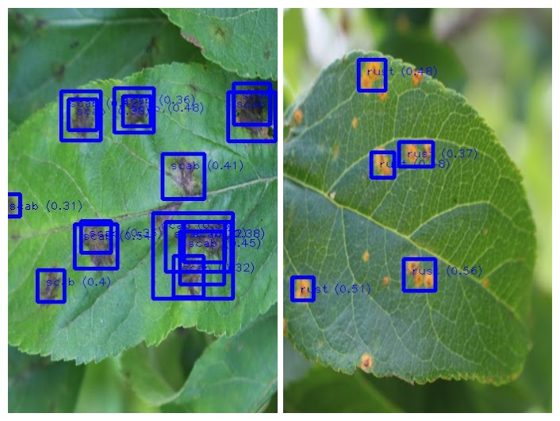

## GlowGreen 

## Understanding Problem Statement 📚

Over the years 2 billion hectares of Forest land on earth has degraded, affecting some 3.2 billion people and driving species to extinction and intensifying climate change. Recent studies have proved that disease infestations are one of the major factors behind the decaying of plants and forests. A major factor behind these infestations are invading alien species or parasites that harm our valuable forests. With the help of Data Science and Machine Learning, it is possible to identify the diseases so that appropriate measures can be taken at the correct instance of time to sustainably manage forests, combat desertification, halt and reverse land degradation, and halt biodiversity loss.


## Motive 🤔

- Existing methods of disease detection require environmentalists and forest-workers to solicit the help of government-funded agricultural experts to visually inspect and diagnose the infested leaf diseases. This suffers from being labor-intensive, low-supply and costly. As an added challenge, effective solutions for concerned people must perform well under significant constraints, since people may only have access to mobile-quality cameras with low-bandwidth.
- This project aims at helping our target customers who are forest and grove conservatives over large ares. Disease infestation from pests, fungus etc is a serious problem currently and needs to eliminated as soon as possible. Checking for fungal infections in vast farmlands can be very time consuming and needs a lot on manual labour. To help the community, we at GlowGreen present our application which will reduce the time required to check whether that part of the forest is diseased or not.


## Prototype Insights 🔥


## Quick start 🚀
*Note:
We recommend installing the requirements inside a [virtualenv](https://virtualenv.pypa.io/en/stable/) to prevent
messing with your system packages. Activate your environment if used before going on to the next steps.*

**Installation**
1. Fork the Project
2. Clone your forked repository on your host machine  
```(bash)
git clone <your-forked-repository.git>
cd GlowGreen
```
3. To install the dependencies and packages on your host machine
```(python)
pip install -r requirements.txt
```
4. That's it! Now test our application by running the following command on your host machine
```(python)
python run.py
```
5. The response output should look like this:
```
 INFO: Created TensorFlow Lite XNNPACK delegate for CPU.
 * Serving Flask app "sollutionChallenge" (lazy loading)
 * Environment: production
 * Running on localhost:5000 (Press CTRL+C to quit)
 ```

## Future Scope 🎯
We are planning to develop an android app using [Flutter](https://flutter.dev). We are also thinking to integrate our application on Live-inference Engine onto IoT devices such as drones, [Raspberry pi](https://www.raspberrypi.org/) etc for large forests where manual labour is a difficult task. We are also planning to extend our application to serve to larger audience from remote areas where good network is not available.

## Tech Stack Used 👩‍💻


